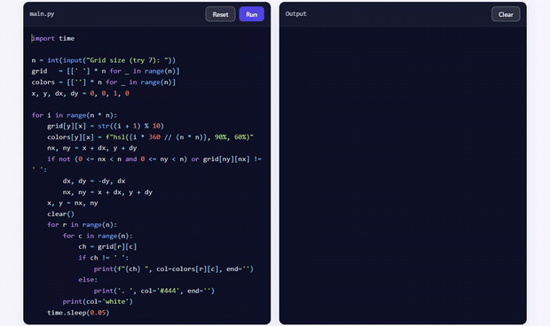
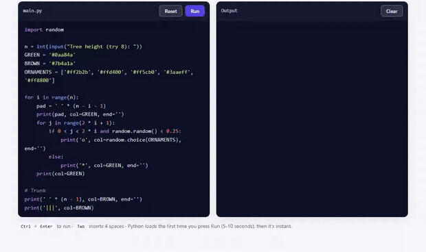
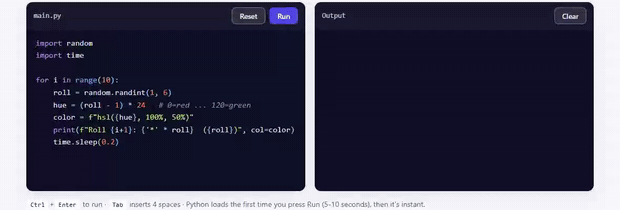

# PyWebLib

Try it here: [pyweb.qmarkapp.com](https://pyweb.qmarkapp.com/)

[](https://github.com/sebastianhagemeyer/PyWebLib/stargazers)

Run real Python in your browser, with nothing to install. **PyWebLib** brings turtle drawing and a beginner game library to the web, for people who cannot be bothered to download Python and just want to play. It is a single static page that runs CPython compiled to WebAssembly with [Pyodide](https://pyodide.org), so every line runs client-side: coloured output, inline `input()`, a turtle window, games, and a click-to-load snippet gallery.

> Bring turtle and Python games to the browser: coloured prints, animation, and inline input(), all client-side, with nothing to download.



## Games in the browser (`import game`)

Sprites, the keyboard, the mouse, collisions and a score, all running smoothly on
a canvas. No install, and none of the extra build steps or tooling (like pygbag)
that pygame needs before it runs in a browser at all. Full walkthrough and a
sprite table are in the [game guide](https://pyweb.qmarkapp.com/docs/game/).

<p>
  
  
  
</p>

## Turtle drawing (`import turtle`)

The classic turtle pen, right in the browser. Forward, turn, change colour,
lift the pen, and a few lines in a loop become squares, stars, flowers and
rainbow spirals. It is the gentlest way into loops and coordinates. Full
walkthrough in the [turtle guide](https://pyweb.qmarkapp.com/docs/turtle/).


## Scope

PyWebLib is deliberately small and self-contained:

- **Static only.** A handful of text files (HTML, one JS file, CSS) plus a favicon. No build step, no server, no database, no accounts.
- **Client-side Python.** Pyodide loads once from a CDN (about 10 MB, cached afterwards) and runs entirely in the browser tab.
- **Made for teaching and tinkering.** Drop it on any static host, share a link, and learners can edit code and press Run.

It is not a full IDE or a hosted notebook. There is no shared file system, no package server, and no persistence beyond your own browser's local storage.

## Examples

Colour, animation, randomness, and interactive input all run as real Python in the page.

**Christmas tree** (random ornaments via `import random`, coloured `print`):



**Heat map dice** (each roll coloured red to green by its value):



There are more in the snippet gallery at the bottom of the page: FizzBuzz, Fibonacci, the Caesar cipher, a Sierpinski triangle, and others.

## Features

- Live editor with syntax highlighting (CodeJar and Prism).
- Real CPython via Pyodide, so `import random`, `math`, `time` and friends just work.
- Interactive `input()` with an inline, terminal-style prompt.
- Coloured output: `print("hi", col="#ff0")` (or `color=`); any CSS colour works.
- A `clear()` builtin to wipe the panel and animate frame by frame.
- Interruptible: a Stop button cancels long loops and sleeps. `Ctrl+Enter` runs.
- Snippet gallery: click a card to load an example.
- Autosave: your code is kept in `localStorage`.

## Quick start

The files are static, but they must be served over http(s). Opening `index.html` as a `file://` URL will not work, because the editor and the WebAssembly runtime are fetched as modules.

On Windows, double-click `serve.bat`. It finds Python, starts a local server, and opens your browser.

Or use any static server:

```bash
python -m http.server 8000
# then open http://localhost:8000
```

Deploy by dropping the files on any static host: GitHub Pages, Netlify, Cloudflare Pages, and so on. There is no build step.

## How it works

- Pyodide (CPython to WebAssembly) loads from the jsDelivr CDN on the first Run, then the browser caches it.
- CodeJar provides the editable area; Prism highlights it on every keystroke.
- The extras (`input()`, `clear()`, coloured `print`, interruptible `sleep`, and the Stop button) are layered onto stock Python at runtime. See the `PY_INSTALL_*` strings in `sandbox.js`.

## Browser support

Interactive `input()` needs WebAssembly JSPI (stack switching), available in Chrome and Edge 137 and newer. Everything else works in any modern browser; without JSPI, `input()` shows a friendly message instead of hanging.

## Customising

- Starter code: edit `DEFAULT_CODE` near the top of `sandbox.js`.
- Snippets: add objects to the `EXAMPLES` array in `sandbox.js`.
- Colours: tweak the CSS variables in `:root` at the top of `styles.css`.

## Community (Google sign-in + sharing)

PyWebLib can run a Scratch-style community: sign in with Google, publish your
programs, upvote others, comment, and climb a leaderboard. It is powered by
[Supabase](https://supabase.com) and is **off by default**, the rest of the site
works fully without it. To switch it on:

1. **Create a Supabase project** (the free tier is fine) at supabase.com.
2. **Run the schema.** Supabase dashboard: SQL Editor -> New query -> paste all
   of `supabase-schema.sql` -> Run. This creates the tables, the row-level
   security policies and the leaderboard view.
3. **Turn on Google sign-in.**
   - In Google Cloud Console, create an OAuth 2.0 Client ID (type: Web
     application) and add this authorised redirect URI:
     `https://YOUR-PROJECT-REF.supabase.co/auth/v1/callback`
   - In Supabase: Authentication -> Providers -> Google -> paste the Client ID
     and Client Secret and enable it.
   - In Supabase: Authentication -> URL Configuration -> add your site to
     "Redirect URLs", e.g. `https://pyweb.qmarkapp.com/**`
     and `http://localhost:8000/**` for local testing.
4. **Add your keys.** In `supabase-config.js`, set `SUPABASE_URL` and
   `SUPABASE_ANON_KEY` (Supabase dashboard -> Project Settings -> API). The anon
   key is public by design; security comes from the RLS policies in the schema.
5. Commit, push and hard-refresh. Sign in, Share, upvotes, comments and the
   Community + Leaderboard pages light up automatically.

Data model (`supabase-schema.sql`): `profiles` (auto-created on first sign-in),
`projects` (a shared program), `votes` (one per user per project, kept counted
by a trigger), `comments`, and a `top_creators` leaderboard view.

## License

Released under CC0 1.0 (public domain), see [LICENSE](LICENSE). Do whatever you like with it. PyWebLib loads Pyodide, CodeJar, and Prism from a CDN; each is under its own permissive license.
